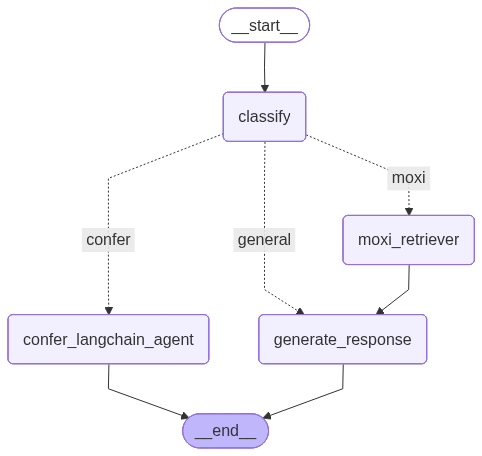

# Confer & MoXi AI Chatbot

A multi-agent RAG chatbot built with LangGraph that intelligently routes queries to specialized agents for Confer AI solutions and MoXi mortgage services, with conversation memory and context-aware responses.

## Architecture



The system uses a LangGraph workflow with:
- **Classify Node** - Routes queries based on content and conversation history
- **Confer LangChain Agent** - Handles Confer AI/ML consulting queries via external API
- **MoXi Retriever** - Retrieves Mexico real estate financing information from Qdrant
- **Generate Response** - Produces context-aware responses for MoXi and general queries

## Features

- **Conversation Memory** - Maintains chat history per session using LangGraph checkpointer
- **Context-Aware Routing** - Classifier considers conversation history for follow-up questions
- **Multi-Session Support** - Each chat thread has isolated memory via unique thread IDs
- **Chat History Sidebar** - Switch between conversations, each preserving its context

## Tech Stack

**Backend:**
- FastAPI + Uvicorn
- LangChain + LangGraph
- LangGraph MemorySaver (checkpointer)
- Qdrant Vector Database
- OpenAI GPT-4

**Frontend:**
- Next.js 14
- React
- Tailwind CSS
- Axios

## API Endpoints

| Method | Endpoint | Description |
|--------|----------|-------------|
| POST | `/chat` | Send message with `question` and `thread_id` |
| GET | `/history/{thread_id}` | Get chat history for a thread |
| GET | `/health` | Health check |

## Local Development

### Backend
```bash
cd Backend
pip install -r requirements.txt
# Add OPENAI_API_KEY and QDRANT_API_KEY to .env
python server.py
```

### Frontend
```bash
cd Frontend
npm install
# Set NEXT_PUBLIC_BACKEND_URL in .env.local
npm run dev
```

## Usage

1. Start backend: `python server.py` (runs on port 8000)
2. Start frontend: `npm run dev` (runs on port 3000)
3. Chat naturally - the system remembers context within each conversation
4. Click "New Chat" to start a fresh conversation with new memory
5. Click previous chats in sidebar to resume them
